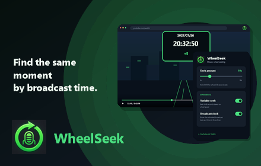
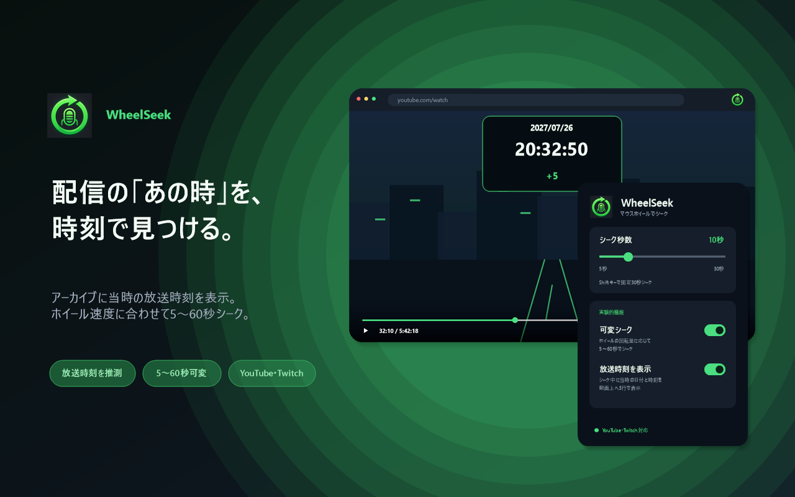
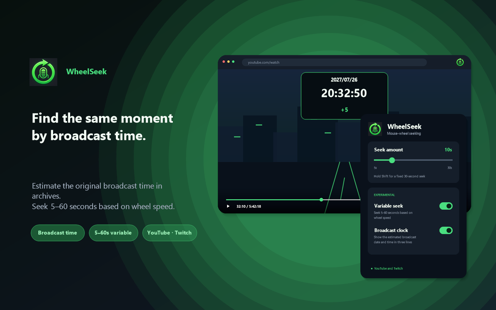

# WheelSeek Chrome Web Store submission resources

このディレクトリには、Chromeウェブストア登録用の文面、回答案、画像を
まとめています。

## 掲載文

- [日本語](listing-ja.md)
- [English](listing-en.md)
- [プライバシーへの取り組み入力案](privacy-dashboard.md)
- [プライバシーポリシー改訂案](privacy-policy-proposed.md)
- [登録チェックリスト](submission-checklist.md)

## 必須画像

### 128×128アイコン


### 440×280プロモーション画像



### 1280×800スクリーンショット

#### 日本語



#### English



スクリーンショットは、放送時刻の推測表示と5～60秒の可変シークを中心に、
実装済みUIと挙動を再構成しています。

## 公式要件

- [Supplying Images](https://developer.chrome.com/docs/webstore/images)
- [Complete your listing information](https://developer.chrome.com/docs/webstore/cws-dashboard-listing)
- [Fill out the privacy fields](https://developer.chrome.com/docs/webstore/cws-dashboard-privacy)
- [Chrome Web Store Program Policies](https://developer.chrome.com/docs/webstore/program-policies)

## 画像の再生成

```powershell
.\tools\generate-store-assets.ps1
.\tools\generate-store-screenshot-01.ps1 -Locale ja
.\tools\generate-store-screenshot-01.ps1 -Locale en
.\tools\generate-store-promo-small.ps1 -Locale en
```
